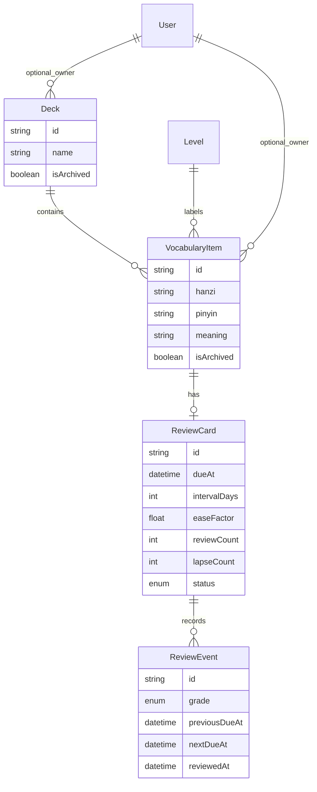

# Architecture

This app is a single-user Mandarin learning companion built with the Next.js App Router, TypeScript, Prisma, PostgreSQL, and Tailwind CSS. The current MVP does not include authentication, so most queries are scoped by active or archived state rather than by user ownership.

## App Structure

The project keeps route files, reusable UI components, and domain logic in separate places:

```text
src/
  app/                  Next.js App Router pages and API routes
  components/           Shared client/server UI components
  lib/                  Prisma client, server actions, and domain utilities
prisma/
  schema.prisma         Database models and relationships
  migrations/           Database migrations
docs/                   Planning, smoke tests, and explanation docs
```

The route files in `src/app` handle page composition and data loading for that page. Reusable forms and interactive UI live in `src/components`. Business rules that should not be buried inside React components live in `src/lib`.

## Main Routes

| Route | Purpose |
| --- | --- |
| `/` | Learning dashboard with real database stats, recent reviews, upcoming due reviews, and level progress. |
| `/vocabulary` | Active vocabulary list with search, level filter, deck filter, CSV export links, and actions. |
| `/vocabulary/new` | Create a vocabulary item and its first review card. |
| `/vocabulary/[id]` | Vocabulary detail page with review card state. |
| `/vocabulary/[id]/edit` | Edit vocabulary fields and deck/level assignment. |
| `/vocabulary/import` | Upload CSV vocabulary and create review cards in batch. |
| `/decks` | Active deck list. |
| `/decks/new` | Create a deck. |
| `/decks/[id]` | Deck detail page with vocabulary in that deck and a study entry point. |
| `/decks/[id]/edit` | Edit or archive a deck. |
| `/decks/[id]/study` | Flashcard study mode for one deck, with all-card and due-only modes. |
| `/review` | Global due review flow across active vocabulary. |
| `/api/vocabulary/export` | CSV export endpoint for active vocabulary, optionally filtered by deck. |

Only implemented routes are linked in primary navigation.

## Data Model

The central models are `VocabularyItem`, `ReviewCard`, `ReviewEvent`, `Deck`, and `Level`.



Important relationships:

- `VocabularyItem` belongs to zero or one `Deck`.
- `VocabularyItem` belongs to zero or one `Level`.
- `VocabularyItem` has zero or one `ReviewCard`, but app flows create exactly one review card for each active study item.
- `ReviewCard` has many `ReviewEvent` records.
- `Deck`, `VocabularyItem`, and `ReviewCard` use archive/status fields instead of hard deletes in normal app flows.
- `User`, `ReviewSession`, `QuizSession`, `QuizQuestion`, `Tag`, and `VocabularyTag` exist for future growth, but the current MVP does not expose auth, quiz mode, or tag management.

## Server Actions and Data Access

Most writes are implemented as server actions in `src/lib`:

| File | Responsibility |
| --- | --- |
| `src/lib/db.ts` | Creates the Prisma client with the Prisma PostgreSQL adapter. |
| `src/lib/vocabulary.ts` | Create, update, and archive vocabulary. Creation also creates a review card. |
| `src/lib/decks.ts` | Create, update, and archive decks. |
| `src/lib/review.ts` | Submit review grades, create review events, update review cards, and revalidate pages. |
| `src/lib/vocabulary-import.ts` | Validate CSV rows, resolve levels/decks, skip duplicates, and batch-create vocabulary with review cards. |
| `src/lib/dashboard.ts` | Reads aggregate counts and activity for the dashboard. |
| `src/lib/csv.ts` | Small CSV parser/exporter used by import and export features. |
| `src/lib/review-scheduler.ts` | Pure spaced repetition scheduler used by review submission. |

Read-heavy pages query Prisma directly inside server components when the query is page-specific. Shared read logic lives in `src/lib/dashboard.ts` when the page needs multiple related stats.

## Review Scheduling

The scheduler is deliberately pure and deterministic. `scheduleReview` accepts the current card state, a grade, and an explicit `now` date. It returns the next scheduling values without mutating its input.

Grades mean:

- `AGAIN`: due again in 10 minutes, lower ease, increment lapse count.
- `HARD`: short interval, lower ease.
- `GOOD`: normal interval growth.
- `EASY`: larger interval growth, higher ease.

The database update happens separately in `src/lib/review.ts`, inside a transaction that creates a `ReviewEvent` and updates the `ReviewCard`.

## Local and Production Runtime

Local development uses Docker Compose PostgreSQL on host port `5433`. The app reads `DATABASE_URL` from the environment and falls back to the documented local connection string in development helpers.

Production deployment should provide a hosted PostgreSQL `DATABASE_URL`, run Prisma migrations with `prisma migrate deploy`, and build the Next.js app with `npm run build`.
