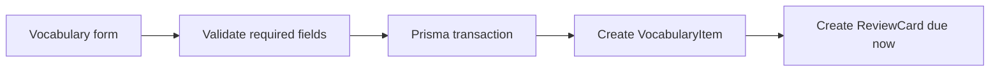
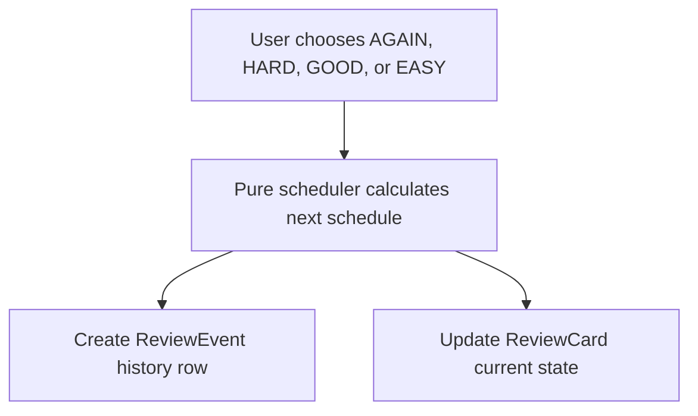

# Feature Walkthrough

This document explains the main product flows in beginner-friendly terms. The big idea is that vocabulary is the learner-facing object, while review cards and review events store the spaced repetition state behind the scenes.

## Creating Vocabulary Creates a ReviewCard

When a learner creates a vocabulary item from `/vocabulary/new`, the form submits to `createVocabularyItem` in `src/lib/vocabulary.ts`.

The required fields are:

- `hanzi`
- `pinyin`
- `meaning`

Optional fields include deck, level, part of speech, measure word, examples, and notes.

The create action validates the required fields first. If validation passes, it opens a Prisma transaction and creates:

- one `VocabularyItem`
- one related `ReviewCard`

The first `ReviewCard.dueAt` is set to the current time, which means the new word is immediately due for review.

This keeps the app from having vocabulary items that cannot be studied.

## Reviewing a Card Creates ReviewEvent and Updates ReviewCard

The review flow appears in `/review` and is reused by deck study mode after a card is revealed. Both submit to `submitReview` in `src/lib/review.ts`.

On submit, the action:

1. Reads the `reviewCardId` and grade.
2. Finds an active review card whose vocabulary is not archived.
3. Calls `scheduleReview` from `src/lib/review-scheduler.ts`.
4. Creates a `ReviewEvent` that records the old and new schedule values.
5. Updates the `ReviewCard` with the new due date, interval, ease factor, review count, and lapse count.

The `ReviewEvent` is history. The `ReviewCard` is current state.

The transaction matters because the history row and current card state should stay in sync.

## Importing CSV Creates Vocabulary and Review Cards

CSV import lives at `/vocabulary/import` and uses `importVocabularyCsv` in `src/lib/vocabulary-import.ts`.

Supported columns:

- `hanzi`
- `pinyin`
- `meaning`
- `level`
- `deck`
- `partOfSpeech`
- `measureWord`
- `exampleChinese`
- `examplePinyin`
- `exampleEnglish`
- `notes`

The import flow:

1. Reads the uploaded CSV file.
2. Parses rows with `parseCsv`.
3. Reports row-level errors for missing required fields or unknown columns.
4. Resolves a level by code or name when provided.
5. Uses an existing active deck by name or creates a new one when the CSV row names a deck.
6. Skips duplicate active vocabulary when `hanzi + pinyin + meaning` already exists in the same deck.
7. Creates each new `VocabularyItem` with a related `ReviewCard` due immediately.

The batch insert runs in a transaction so the import can keep vocabulary and review-card creation together.

## Decks Organize Vocabulary

Decks are study sets. A vocabulary item can belong to one optional deck.

Deck pages let the learner:

- create decks
- edit deck names and descriptions
- archive decks
- view vocabulary assigned to a deck
- start deck study mode

Archiving a deck hides it from the active deck list. It does not hard-delete vocabulary. This is safer for a study app because user-created learning data should not disappear by accident.

## Deck Study Mode Reuses Review Logic

Deck study mode lives at `/decks/[id]/study`.

It has two modes:

- `All cards`: active vocabulary in the deck with active review cards.
- `Due only`: active vocabulary in the deck where the review card is due now.

The page excludes:

- archived decks
- archived vocabulary
- non-active review cards

The flashcard UI in `src/components/deck-study-cards.tsx` shows:

- front: hanzi
- reveal: pinyin, meaning, and optional example
- previous/next navigation
- review grade buttons after reveal

Those grade buttons submit to the same `submitReview` action used by the global review page. That means deck study does not duplicate scheduler logic or create a second review system.

## Dashboard Reads Real DB Stats

The dashboard at `/` calls `getDashboardData` in `src/lib/dashboard.ts`.

It reads real database data for:

- total active vocabulary
- due review cards now
- reviews completed today
- archived vocabulary count
- recent review activity
- upcoming due reviews
- level progress breakdown

The dashboard excludes archived vocabulary from active totals and due review counts. The "today" calculation uses a UTC day range so review counts are stable across server environments.

## CSV Export

CSV export is handled by `/api/vocabulary/export`.

It exports active vocabulary by default and can be filtered by deck. The endpoint includes useful learning fields such as hanzi, pinyin, meaning, level, deck, examples, and notes.

Archived vocabulary is not included in the default export because archived items are no longer part of normal active study flows.

## Why the Domain Logic Matters

This project is more than basic CRUD because the important behavior is about learning state:

- Every vocabulary item should have a review card.
- Review submissions must update current state and write history.
- Scheduling must be deterministic and testable.
- Import must validate rows and avoid duplicate study cards.
- Deck study should reuse the review system instead of inventing a parallel one.
- Dashboard metrics should come from real learning data.

Those rules make the app a stronger full-stack portfolio project than a simple create/read/update/delete demo.
